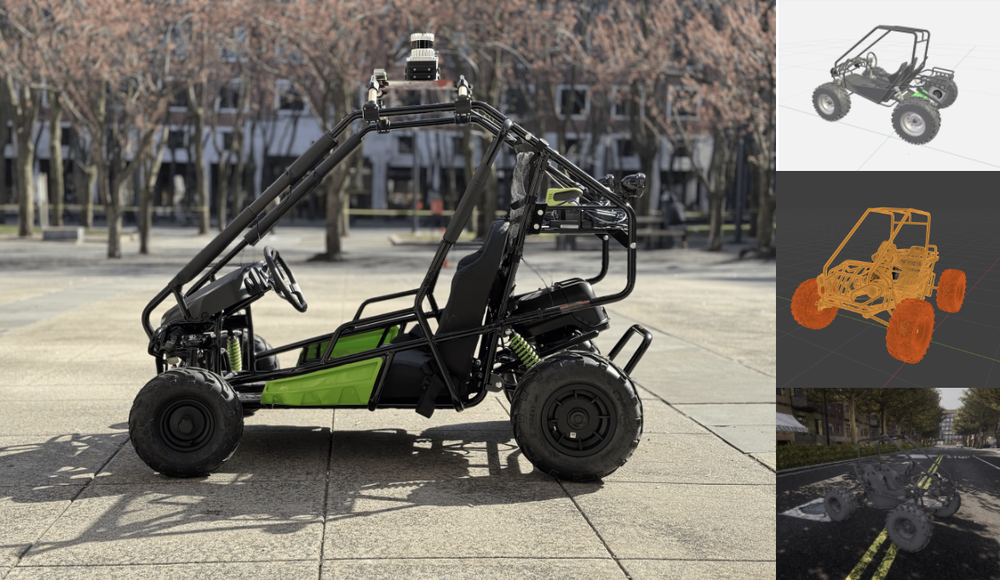

## CARLA Bunny - An Autoware Vehicle and Sensor Kit Launch Package

This is a subproject under the parent project: [Multimodal Embodied AI for Anomaly Detection in Autonomous Vehicles](https://github.com/Officially-Siddhant/multimodal-av-anomaly-detection/tree/main). However, given that Bunny is a test-bed for several project groups to test their algorithms and subsystems on, this repository can be used as a standalone, modular simulation and deployment package for Autoware-integrated vehicles in CARLA, providing a standardized vehicle model, sensor suite, and launch pipeline for rapid development, benchmarking, and validation of autonomy stacks.  

Bunny is a car! It is the currently the closest render of the Offroading Kart from Greenworks that we've built at ASAS Labs. This repository builds packages that must be present within the autoware folders for the vehicle to expose information from CARLA to Autoware 1.7.1.

This package is used at *Autoware launch time*. When the Autoware-CARLA Bridge is being used, this package is launched in a separate autoware workspace terminal.

### System Requirements

- Ubuntu - 22.04. 
- ROS2 Humble
- Autoware 1.7.1

